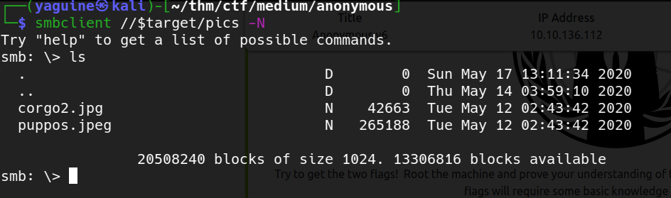

# Anonymous Writeup

### room tags
* security
* linux
* permissions
* medium

### questions
* enumerate the machine. How many ports are open ?
* what service is running on port 21 ?
* what service is running on ports 139 and 445 ?
* there's a share on the user's computer. What's it called ?
* user flag
* root flag

---

## User flag

### nmap 

  

with nmap we can answer the first 3 questions
* How many ports are open ?	*3*
* what service is running on port 21 ?	*ftp*
* what service is running on ports 139 and 445 ? *smb*

### smb

we use enum4linux for smb enumeration  
with `enum4linux -S <ip>` we retrieve the shares  
  

we answer the next question  
* there's a share on the user's computer. What's it called ? *pics*  

  
we also discover the user *namelessone*  

we can access the share *pics* with `smbclient` anonymously   
  

we download the 2 pictures and try a couple of steganography tricks, but it doesn't work  

  
we also try to check if we can access a share called *namelessone* as *namelessone*  
after some password guessing it doesn't seem to work  

### ftp 

the ftp can be accessed anonymously  
there are a couple of interesting files : *clean.sh* and *removed_files.log*  

  
so, clean is adding a line to *removed_files.log* everytime it's executed  
is it a cronjob ?? lets download *removed_files.log* again and compare the number of lines  

  
okay, so clean.sh is being executed by a user on the machine !!  

now we have to substitute "clean.sh" with a payload  
lets comment all the lines and add a reverse shell command  
  

let's start a **netcat listener** on port 443  
now we enter the ftp server and use the command `put clean.sh clean.sh` to subsitute the ftp's script with our script  
in a little time we will receive our reverse shell and we retrieve **user.txt** !!  
  

---

## Root flag

`find / -perm /u=s,g=s -type f 2>/dev/null` to find SUID files  
there is a interesting one, */usr/bin/env*  
thanks to [GTFOBins](https://gtfobins.github.io/) we discover that we can use it to escalate privileges  
`env /bin/bash -p` and we have our root shell  
time to retrieve **root.txt** !!!

---
